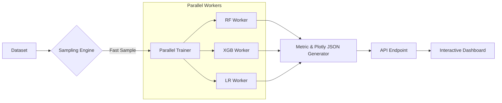

# White Paper: High-Speed Model Comparison & Visualization
**Author**: OneClick.AI Engineering Team  
**Objective**: Enable users to instantly compare multiple ML algorithms visually using Plotly.

---

## 1. Executive Summary
The goal is to provide a "pre-train" comparison dashboard where users can upload a preprocessed dataset and see how different algorithms (Random Forest, XGBoost, etc.) perform. To ensure a "WOW" experience, the architecture prioritizes **latency (speed)** and **interactivity (Plotly)**.

---

## 2. High-Level Architecture

The system uses a **Sample-First, Parallel-Always** approach. Instead of training on the full data, we use a statistically significant sample to generate results in seconds.



---

## 3. Implementation: The Backend (Python/FastAPI)

### A. Parallel Grid Training
We use `concurrent.futures` to evaluate all models at once. This reduces the total time to the duration of the *slowest* single model.

```python
import pandas as pd
from concurrent.futures import ProcessPoolExecutor
import plotly.express as px

def evaluate_algorithm(name, model, X_train, y_train, X_test, y_test):
    """Trains a model and returns metrics + Plotly JSON."""
    model.fit(X_train, y_train)
    probs = model.predict_proba(X_test)[:, 1]
    
    # Generate Plotly ROC Curve
    fig = px.roc_curve(y_test, probs)
    return {
        "name": name,
        "metrics": {"accuracy": model.score(X_test, y_test)},
        "chart_json": fig.to_json()
    }

# Main Parallel Logic
with ProcessPoolExecutor(max_workers=4) as executor:
    tasks = [executor.submit(evaluate_algorithm, name, m, ...) for name, m in models.items()]
    results = [t.result() for t in tasks]
```

### B. Speed Optimization (Sampling)
Before training, we sample the data to ensure the comparison finishes in < 5 seconds.

```python
# Sample 10k rows if the dataset is larger
if len(df) > 10000:
    df_sample = df.sample(n=10000, random_state=42)
else:
    df_sample = df
```

---

## 4. Implementation: The Frontend (HTML/JS/CSS)

By sending **JSON data** instead of images, the UI remains perfectly crisp and interactive. We use the **Plotly.js CDN** for zero-install rendering.

### HTML Structure
```html
<!-- Load Plotly via CDN -->
<script src="https://cdn.plot.ly/plotly-2.24.1.min.js"></script>

<div id="comparison-dashboard">
  <div id="summary-metrics"></div>
  <div id="charts-grid" class="grid-container"></div>
</div>
```

### Vanilla JavaScript Logic
```javascript
async function fetchComparison() {
    const response = await fetch('/api/model-compare');
    const data = await response.json();
    
    const grid = document.getElementById('charts-grid');
    
    data.forEach(result => {
        // Create an interactive plot container
        const chartId = `chart-${result.name}`;
        const div = document.createElement('div');
        div.id = chartId;
        div.className = 'chart-card';
        grid.appendChild(div);
        
        // Plotly renders directly into the DIV
        Plotly.newPlot(chartId, result.chart_json.data, {
            ...result.chart_json.layout,
            responsive: true
        });
    });
}
```

---

## 5. Visual Comparison Metrics (The "WOW" Factor)

A premium dashboard should include:
1. **Radar Charts**: Compare Accuracy vs. Recall vs. Training Speed.
2. **Confusion Matrix Heatmap**: Clickable tiles that show exactly where the model fails.
3. **Combined Line Plot**: Overlaying multiple ROC curves on a single chart to see who captures the "Top Left" corner best.
4. **CSS Micro-Animations**: Use `transition: transform 0.3s` to make cards scale on hover for a premium "app" feel.

---

## 6. Simple Explainers (The "AI Prompt")

If you are using an AI assistant (Gemini, Claude, or ChatGPT) to help you build this, give it this exact prompt:

> **"I want to build a 'Model Performance Comparison' dashboard for my ML SaaS platform. The goal is to let users upload a dataset and instantly see a visual comparison of multiple algorithms (like Random Forest, XGBoost, and Logistic Regression) using interactive Plotly charts. Please explain how to build this with a FastAPI backend and a frontend using only Vanilla HTML, CSS, and JavaScript. Focus on using data sampling and parallel processing to keep it extremely fast (under 5 seconds). Include code examples for the Python API and the Plotly.js implementation."**

---

## 7. Deployment Guidelines

> [!IMPORTANT]
> **Use Parquet**: For the sampled data, use `.parquet` format. It is up to 10x faster to read than `.csv`.

---

## 8. Conclusion
This architecture allows for a seamless, "OneClick" experience where data is transformed into insights instantly. By offloading the rendering to Plotly.js and parallelizing the backend, we achieve a modern, high-performance ML platform WITHOUT the complexity of frontend frameworks.
